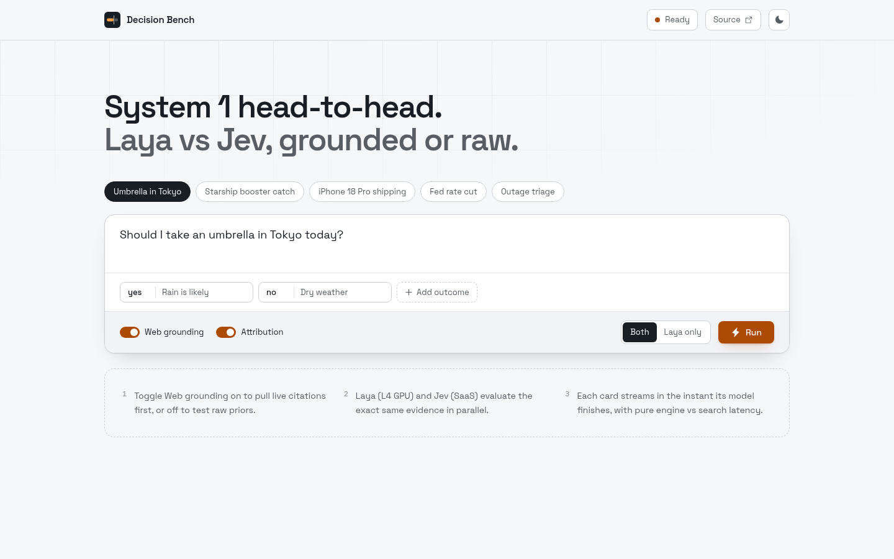
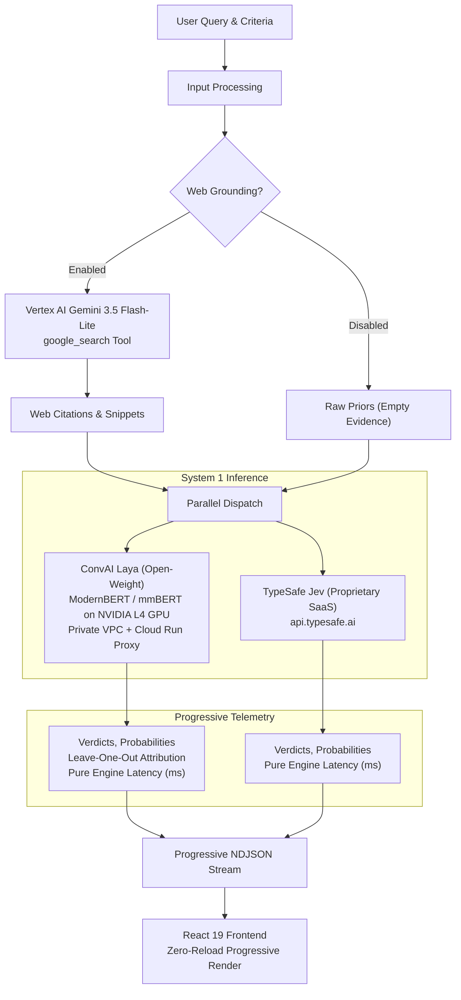
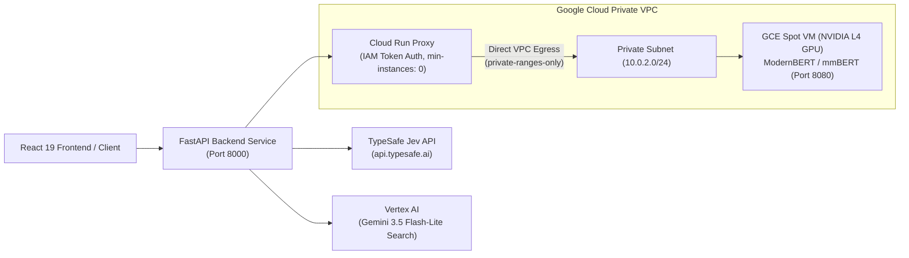

# System 1 Head-to-Head Decision Bench

A production benchmark and evaluation console comparing fast, calibrated System 1 decision models: **ConvAI Laya** (open-weight ModernBERT on private NVIDIA L4 GPU) versus **TypeSafe Jev** (multi-tenant SaaS API), evaluated with and without live web grounding.

---

## Visual Walkthrough

### 1. Head-to-Head Comparison with Live Web Grounding (Dark Theme)
Laya (L4 GPU) and Jev (SaaS) evaluate the exact same web citations in parallel. Each engine card renders the instant its inference finishes, displaying pure engine latency alongside web search latency.


### 2. Head-to-Head Comparison with Raw Priors (Dark Theme)
With Web Grounding disabled, both models evaluate the scenario using pure internal priors in sub-100ms.


### 3. Laya-Only Mode with Leave-One-Out Source Attribution (Light Theme)
In Laya-only mode, the console displays the full source attribution ledger, showing the exact point shift (`+N pt`, `-N pt`) that each web citation contributed to the verdict.


### 4. Interactive Scenario Presets
Pre-configured scenarios allow instant testing of real-world decision boundaries across weather, finance, technology, and multilingual queries.



---

## Architecture



### Infrastructure Topology



---

## Key Capabilities

* **System 1 Head-to-Head Comparison**: Compare self-hosted open-weight decision models (ConvAI Laya) directly against commercial decision APIs (TypeSafe Jev) on identical inputs.
* **Grounding Toggle**: Switch between **Web Grounding** (live Google Search citations via Vertex AI) and **Raw Priors** (pure model weights) with a single click.
* **Isolated Latency Telemetry**: Every stream event, metric card, and telemetry bar separates:
  * `search_latency_ms`: Time taken to fetch live web search citations (~1.1 s).
  * `laya_latency_ms`: Pure single-pass GPU forward pass time (~35–45 ms).
  * `jev_latency_ms`: Pure SaaS API request time (~250–300 ms).
  * `total_latency_ms`: Complete wall clock duration.
* **Leave-One-Out Source Attribution**: Quantifies how much each individual citation influenced Laya's final probability score.
* **Zero-Reload Progressive Streaming**: Powered by `application/x-ndjson`. The React workspace maintains a stable component tree with no unmounting or flickering as stages finish.
* **Resilient VPC Connectivity**: Cloud Run proxy uses Direct VPC Egress with a 2.5-second TCP connection timeout to fail fast if the GPU VM is stopped or preempted.

---

## Installation & Setup

### Prerequisites

* Python 3.12+ with [`uv`](https://docs.astral.sh/uv/)
* Node.js 20+ with [`bun`](https://bun.sh/)
* Google Cloud CLI (`gcloud`) authenticated to your project

### 1. Install Dependencies

```bash
# Install backend dependencies
cd backend && uv sync && cd ..

# Install frontend dependencies
cd frontend && bun install && cd ..
```

### 2. Configure Environment

Copy the example environment file and configure your endpoints:

```bash
cp backend/.env.example backend/.env
```

Edit `backend/.env` with your settings:

```dotenv
# Google Cloud Project & Vertex AI
GOOGLE_CLOUD_PROJECT=your-gcp-project-id
VERTEX_LOCATION=global
GEMINI_MODEL=gemini-3.5-flash-lite

# ConvAI Laya GPU Proxy Endpoint
LAYA_ENDPOINT=https://laya-gpu-proxy-xyz-uc.a.run.app/predict
LAYA_TIMEOUT_SECONDS=45.0
LAYA_PROBE_TIMEOUT_SECONDS=8.0

# TypeSafe Jev API
JEV_ENDPOINT=https://api.typesafe.ai/v1/systemone
TYPESAFE_API_KEY=your-typesafe-api-key

# Decision Settings
CONFIDENCE_THRESHOLD=0.60
MAX_SEARCH_SOURCES=5
```

### 3. Run Development Servers

Start both the FastAPI backend and Vite frontend with hot reload:

```bash
make dev
```

* Frontend: `http://localhost:5173`
* Backend API & Docs: `http://localhost:8000/docs`

---

## CLI Usage

You can also run decisions directly from the terminal using the CLI:

```bash
# Compare Laya and Jev on a query with web grounding
uv run --directory backend laya-agent compare "Will the Federal Reserve cut rates this month?" \
  --criteria yes="Rate cut expected" no="Rates held steady"

# Run Laya-only decision with raw priors (no web search)
uv run --directory backend laya-agent decide "Is Python a statically typed language?" \
  --criteria yes="Statically typed" no="Dynamically typed" \
  --no-search

# Check system health and Laya reachability
uv run --directory backend laya-agent status
```

---

## Makefile Targets

| Target | Description |
| :--- | :--- |
| `make start` | Start production servers (frontend + backend via `concurrently`) |
| `make dev` | Start development servers with hot reload |
| `make test` | Run backend and frontend test suites (`pytest` + `vitest`) |
| `make format` | Format code (`ruff format` + `biome format`) |
| `make lint` | Lint code (`ruff check` + `biome check`) |
| `make clean` | Remove build artifacts and temporary cache files |
| `make check` | Run complete validation pipeline (`format` -> `lint` -> `test`) |
| `make start-vm` | Check gcloud auth and start the GPU VM if stopped |
| `make stop-vm` | Stop the GPU VM to halt compute charges immediately |
| `make status-vm` | Display GPU VM status, machine type, and provisioning model |
