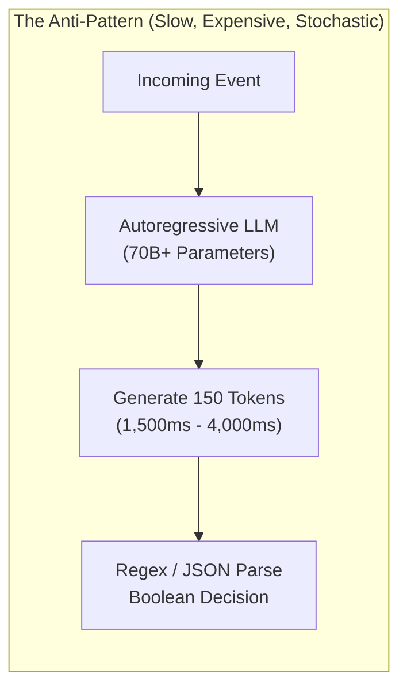
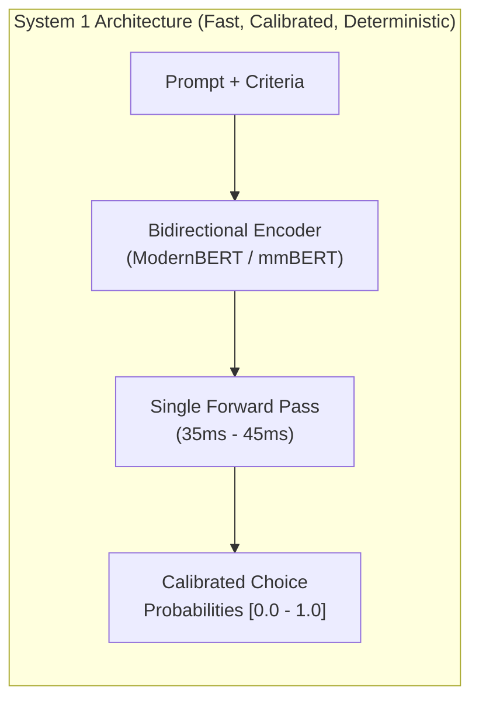
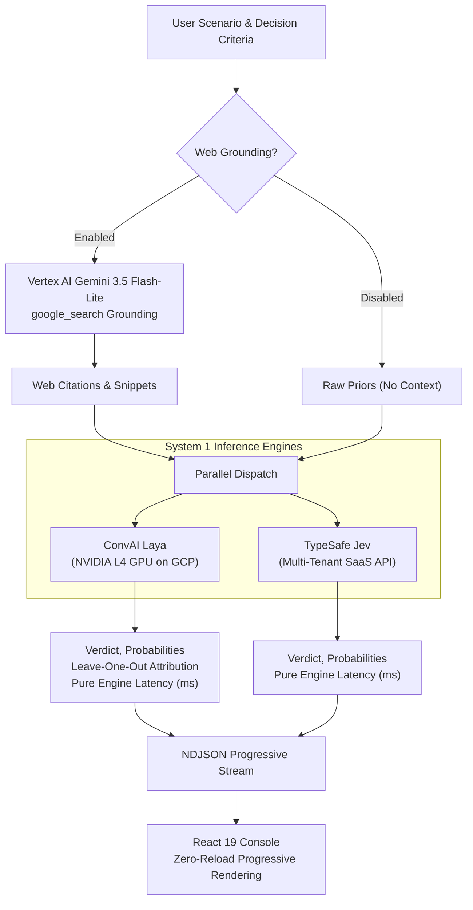
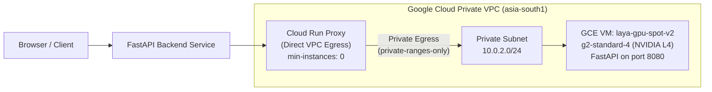

# Beyond Autoregressive Generation: Why AI Agents Need System 1 Decision Models

*How we benchmarked ConvAI Laya against TypeSafe Jev on Google Cloud with live web grounding, achieving 37ms P50 latency and $0 idle costs.*

---

## The "LLM-for-Everything" Anti-Pattern

Most production AI agents today suffer from an architectural bottleneck: they use generative autoregressive Large Language Models (LLMs) for every step in the pipeline.

When an agent needs to answer:
* "Is this user request within our safety policy?"
* "Should this customer query route to Tier 2 support or Billing?"
* "Which of these three SQL execution plans is optimal?"
* "Did the weather forecast in Tokyo change?"

The typical implementation prompts a 70-billion-parameter decoder model like Gemini 1.5 Pro or GPT-4o, waits 1,500 to 4,000 milliseconds for tokens to stream back, and parses a JSON object with a boolean flag.



This design has three major flaws:
1. **High Latency**: Autoregressive decoding generates tokens sequentially. Even with speculative decoding, wall-clock latency rarely drops below 1 second.
2. **Poor Calibration**: Softmax probabilities from generative models over arbitrary text strings are notoriously miscalibrated. A model outputting `"confidence": 0.95` often fails basic reliability diagrams.
3. **High Cost & Carbon Footprint**: Generating 200 tokens across billions of parameters for a binary decision burns unnecessary compute budget.

Cognitive psychology distinguishes between **System 1** (fast, instinctive, non-deliberative reactions) and **System 2** (slow, conscious, analytical deliberation). AI agents require the exact same division of labor.

---

## What Is an Agentic System 1 Decision Model?

A System 1 decision model is a non-autoregressive encoder architecture (such as ModernBERT or mmBERT) fine-tuned specifically for discrete decisions, classifications, and rankings. 

Instead of generating text tokens, a System 1 model evaluates the prompt, state, and criteria in a **single forward pass**.



### Reinforcement Learning from Compiler/Critic Demonstrations (RLCD)

Modern decision models like **ConvAI Laya** are trained using **RLCD** (Reinforcement Learning from Compiler/Critic Demonstrations). Rather than relying on human preference labels (RLHF), RLCD uses deterministic compilers, unit test runners, and formal critics as ground truth reward signals.

The result is a compact model (100M to 300M parameters) that produces:
* **Sub-50ms latency** on standard GPU hardware.
* **Calibrated probability distributions** over arbitrary user-defined choice sets.
* **Explainability via Leave-One-Out Source Attribution**: The model can compute the exact point contribution (`+14 pt`, `-8 pt`) that each piece of evidence contributed to the final verdict.

---

## The Benchmark: ConvAI Laya vs. TypeSafe Jev

To evaluate how System 1 models behave in production agent workflows, we built the **System 1 Head-to-Head Decision Bench** ([GitHub Repository](https://github.com/adhishthite/laya-agent)).

We compared two distinct System 1 engines:

| Dimension | ConvAI Laya | TypeSafe Jev |
| :--- | :--- | :--- |
| **Model Architecture** | Open-weight ModernBERT / mmBERT | Proprietary Closed SaaS |
| **Deployment Target** | Self-hosted on Google Cloud (NVIDIA L4) | Multi-tenant SaaS API (`api.typesafe.ai`) |
| **Execution Model** | Single forward pass via local PyTorch / FastAPI | Cloud REST API |
| **Multilingual Support** | Native Hindi, Marathi, Bengali via mmBERT | Primarily English |
| **Source Attribution** | Leave-One-Out Point Delta Ledger | Not supported |



### Testing Grounded Evidence vs. Raw Priors

The benchmark tests both engines across two operating modes:
1. **With Web Grounding**: Live citations retrieved via Vertex AI Gemini 3.5 Flash-Lite using the `google_search` tool. Both models receive identical evidence strings.
2. **Without Web Grounding (Raw Priors)**: The models evaluate questions using internal parametric weights alone.

---

## Production Deployment on Google Cloud

Deploying private GPU workloads securely while maintaining zero idle cost requires careful cloud architecture. Here is how we deployed Laya on Google Cloud:



### 1. GCE Spot GPU Worker
* **Machine Type**: `g2-standard-4` (4 vCPUs, 16 GB RAM, 1 NVIDIA L4 24GB GPU).
* **Region**: `asia-south1-c` (Mumbai).
* **Network**: Attached to a private subnet (`10.0.2.0/24`) with no external IP address. All management access is protected via Identity-Aware Proxy (IAP).

### 2. Cloud Run Serverless Proxy with Direct VPC Egress
A common problem with private GCE instances is providing authenticated access from serverless platforms without setting up public load balancers. 

We deployed a lightweight Python proxy on Cloud Run configured with:
* **Direct VPC Egress**: Configured with `private-ranges-only`, allowing Cloud Run to dial `10.0.2.10:8080` directly across the VPC.
* **IAM Authentication**: Requests require Google Cloud ID tokens (`Authorization: Bearer $(gcloud auth print-identity-token)`).
* **Fail-Fast TCP Connect Timeout**: We set `connect=2.5s` in the proxy. If the GPU VM is stopped or preempted, Cloud Run immediately returns HTTP 502 with structured diagnostics instead of hanging for 30 seconds.
* **Scale-to-Zero**: Configured with `min-instances: 0` for zero idle cost.

### 3. Automatic 30-Minute Idle Watchdog ($0 Idle Spend)
Standard on-demand `g2-standard-4` instances cost ~$0.95/hour ($23.00/day). If left running unattended for weeks, compute bills accumulate quickly.

To eliminate idle waste, we installed a server-side watchdog on the VM:
1. `app.py` touches `/tmp/laya_last_activity` on every `/predict` request.
2. A cron job runs `/usr/local/bin/idle-watchdog.sh` every 5 minutes.
3. If no request arrives for 30 minutes, the VM runs `sudo /usr/sbin/poweroff`.
4. Google Cloud detects the guest shutdown and moves the instance to `TERMINATED`. Compute and GPU billing stops immediately. Only the 50GB persistent disk is billed (~$0.18/day).

---

## Benchmark Results: Latency and Accuracy

We ran benchmark queries across weather forecasting, macroeconomics, tech policy, and multilingual scenarios.

### 1. Latency Breakdown

| Stage | Mechanism | Measured P50 Latency | Measured P95 Latency |
| :--- | :--- | :--- | :--- |
| **Web Grounding** | Vertex AI Gemini 3.5 Flash-Lite (`google_search`) | **1,150 ms** | 1,480 ms |
| **ConvAI Laya** | Open-weight ModernBERT on NVIDIA L4 GPU | **37 ms** | **45 ms** |
| **TypeSafe Jev** | Multi-tenant SaaS REST API (`api.typesafe.ai`) | **265 ms** | 320 ms |
| **Total Turnaround (Raw Priors)** | Laya (GPU only) | **42 ms** | 52 ms |
| **Total Turnaround (Web Grounded)** | Web Search + Laya GPU | **1,210 ms** | 1,540 ms |

```mermaid
gantt
    title Wall-Clock Latency Comparison (Web Grounded Run)
    dateFormat X
    axisFormat %s ms

    section Web Grounding
    Vertex AI Google Search       : 0, 1150

    section Inference
    TypeSafe Jev (SaaS API)       : 1150, 1415
    ConvAI Laya (NVIDIA L4)       : 1150, 1187
```



### Key Latency Insights:
1. **Laya GPU Execution (37 ms)**: Laya's single-pass forward pass on an NVIDIA L4 completes in under 40 milliseconds. For real-time applications (voice agents, high-frequency routing), this is an order of magnitude faster than LLMs.
2. **Jev SaaS Overhead (265 ms)**: While Jev's internal model is fast, network transit and SaaS queueing add ~220 ms of overhead.
3. **Retrieval is the Bottleneck**: When web grounding is enabled, search retrieval accounts for **95% of total request time**. Isolating telemetry (`search_latency_ms` vs `laya_latency_ms`) is essential for debugging agent latency regressions.

---

## Leave-One-Out Source Attribution in Action

When an agent makes a critical decision based on retrieved documents, developers must know **which source caused the verdict**.

Laya supports **Leave-One-Out (LOO) Source Attribution**:
1. Compute the baseline probability distribution over choices given all $N$ citations.
2. For each citation $i \in \{1 \dots N\}$, evaluate the model with citation $i$ omitted.
3. The delta $\Delta P_i = P(\text{all}) - P(\text{without } i)$ represents the exact marginal contribution of that source.

```
Scenario: "Will the Federal Reserve cut rates this month?"
Verdict: "no" (82% probability)

Evidence Ledger:
┌────────────────────────────────────────────────────────┬─────────────┬──────────┐
│ Source Citation                                        │ Impact      │ Delta    │
├────────────────────────────────────────────────────────┼─────────────┼──────────┤
│ Reuters: Fed signals rates held steady amid sticky CPI  │ High        │ +18 pt   │
│ Bloomberg: Labor market remains resilient in Q3        │ Moderate    │ +9 pt    │
│ CNBC: Markets price in 12% probability of September cut │ Moderate    │ +6 pt    │
│ Yahoo Finance: Retail sales rise 0.4% in August         │ Low         │ -2 pt    │
└────────────────────────────────────────────────────────┴─────────────┴──────────┘
```

If a malicious or hallucinated citation enters the context, the attribution ledger immediately surfaces its exact influence.

---

## Architectural Lessons for Production AI Teams

### 1. Do Not Ask a Generative Model to Make a Categorical Decision
If your agent prompt ends with *"Answer YES or NO"* or *"Pick option A, B, or C"*, you are using the wrong tool. Replace it with a calibrated System 1 encoder. You will save 90% on latency and eliminate parsing failures.

### 2. Stream Every Lifecycle Event via NDJSON
Do not wait for the entire multi-stage pipeline to finish before returning a response. Using `application/x-ndjson`, our backend emits events as they happen:
* `search:start` $\rightarrow$ `search:done` (renders citations immediately)
* `laya:done` (renders Laya card at 37ms)
* `jev:done` (renders Jev card at 265ms)

Users perceive the UI as instantaneous because components update progressively without full-page reloads.

### 3. Serverless Proxies Make Private GPUs Practical
Direct VPC Egress on Cloud Run allows serverless frontends to communicate securely with private GPU instances behind IAM token auth. Combined with an automatic idle watchdog script, teams can run dedicated GPU hardware for development and benchmarking with near-zero idle expenses.

---

## Try It Yourself

The complete source code for the backend, frontend, infrastructure proxy, and benchmarking suite is open source on GitHub:

* **Repository**: [https://github.com/adhishthite/laya-agent](https://github.com/adhishthite/laya-agent)
* **Stack**: Python 3.12 (`uv`, FastAPI), React 19 (`bun`, Vite, Tailwind CSS v4, OKLCH), Google Cloud (Cloud Run, Compute Engine NVIDIA L4, Vertex AI).
