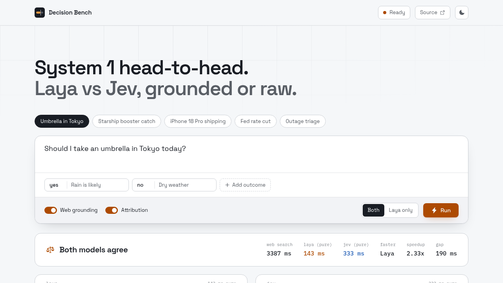
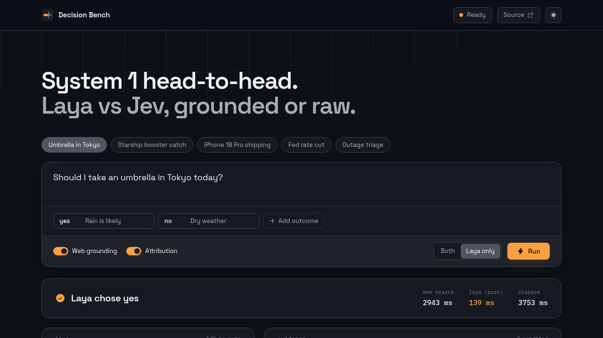

# System 1 in the Wild: Benchmarking Laya vs. Jev With and Without Web Grounding

When you give a decision model live Google Search evidence, it acts as a calibrated adjudicator. When you strip the evidence away, it becomes an instant 37-millisecond sanity checker on pure priors. 

I pitted ConvAI Laya and TypeSafe Jev against each other—and open-sourced the benchmark—to understand how System 1 models actually behave in production, both with live web grounding and on raw model priors.

The entire system runs on Google Cloud infrastructure. It brings together Vertex AI for live search grounding, Compute Engine with NVIDIA L4 GPUs for fast decision inference, and Cloud Run for serverless networking.

For two years, AI engineering has suffered from an "LLM-for-everything" anti-pattern. Every time an agent needs to route a ticket, check a policy, or evaluate a condition, we prompt a 70B generative model, wait two to four seconds for tokens, and parse a JSON object. We burn thousands of tokens on tasks that require zero text generation.

In cognitive psychology, Kahneman's System 1 handles fast, automatic reflexes, while System 2 handles slow, deliberate analysis. AI agents need the exact same division of labor. You do not wake up a 70B reasoning model to decide whether to open an umbrella; you use a fast, calibrated reflex.

A System 1 decision model is not a "smaller LLM." It is a non-autoregressive bidirectional encoder (like ModernBERT or mmBERT). Instead of generating text tokens sequentially, it processes the prompt, criteria, and evidence in a single forward pass—returning calibrated probabilities across discrete choices in under 40 milliseconds.

To test this in practice, I compared the two primary System 1 engines available today: ConvAI Laya and TypeSafe Jev. Laya is an open-weight model that I self-hosted on an NVIDIA L4 GPU on Google Cloud. Jev is a multi-tenant proprietary SaaS API. Both receive the exact same inputs: a scenario, a set of discrete criteria, and optional web citations. I wanted to see whether open weights on private hardware could match or outperform a specialized commercial endpoint.

What makes these models calibrated where generative LLMs fail? The foundation is RLCD—Reinforcement Learning from Compiler/Critic Demonstrations. Instead of relying on human preference scores (RLHF) that reward plausible-sounding prose, RLCD trains the encoder against deterministic compilers and formal critics. When the model reports 82% confidence, it reflects genuine calibration, not hallucinated bravado.

I structured the benchmark around two modes. In the first mode, both models receive live Google Search citations retrieved via Vertex AI Gemini 3.5 Flash-Lite. In the second mode, I disable search completely, forcing the models to decide purely from their pre-trained weights. This side-by-side comparison answers a fundamental question: how much does external evidence actually shift a System 1 verdict, and how does the model behave when relying solely on its priors?

With Web Grounding enabled, both Laya and Jev evaluate the exact same citations in parallel. Each engine card renders the instant its inference completes, displaying pure engine latency alongside web search latency.

When you toggle search off, the latency collapses from 1.2 seconds to under 50 milliseconds. Both models evaluate the query against their internal parametric weights alone.

When you look at the numbers, an important fact becomes clear: search is the real bottleneck.

In grounded mode, Google Search took 1,150 milliseconds. But Laya took only 37 milliseconds on the GPU, and Jev took 265 milliseconds over the network.

In other words, search took 95% of the total time. The decision model finished in the blink of an eye.

If your system does not measure search time and model time separately, you will make a mistake. You will blame the model for delays caused by the search.

Speed is only half the story. When an agent makes an important decision, you must know why.

Laya provides Leave-One-Out source attribution. The model runs the decision multiple times. Each time, it removes one source. This calculation shows the exact point change for each piece of evidence.

In the UI, you see an evidence ledger. It shows whether a source added 18 points to the verdict or removed 2 points. If a bad source enters the context, you see its effect immediately.

Many teams avoid self-hosting models because GPU servers cost too much when idle.

Google Cloud makes this architecture practical, fast, and secure. The entire platform runs on three core Google Cloud services:

1. **Compute Engine with NVIDIA L4 GPUs**: The `g2-standard-4` instance hosts the Laya model in a private subnet with zero public IPs. It delivers 37-millisecond decision inference without internet exposure.
2. **Cloud Run with Direct VPC Egress**: Cloud Run scales to zero instances when idle. It verifies IAM identity tokens and connects directly to the private GPU instance across the VPC. You do not need expensive static load balancers or public IP addresses.
3. **Vertex AI Search Grounding**: Gemini 3.5 Flash-Lite retrieves live web citations using Google Search in a single API call.

To eliminate idle waste, I installed a 30-minute watchdog script on the GPU instance. If no requests arrive for 30 minutes, the instance executes a clean shutdown. Compute and GPU billing stops immediately. The idle compute cost is $0.

How should you use this in your own systems?

Use System 1 for deterministic questions: routing tickets, checking policies, scoring options, and evaluating guardrails. Use System 2 when you need creative writing, complex synthesis, or open-ended dialogue.

Do not ask a generator to do a classifier's job.

---

### Try It Yourself

The complete source code for the backend, frontend, and infrastructure proxy is open source on GitHub:

* **Repository**: [https://github.com/adhishthite/laya-agent](https://github.com/adhishthite/laya-agent)
* **Stack**: Python 3.12 (`uv`, FastAPI), React 19 (`bun`, Vite, Tailwind CSS v4, OKLCH), Google Cloud (Cloud Run, Compute Engine NVIDIA L4, Vertex AI).
