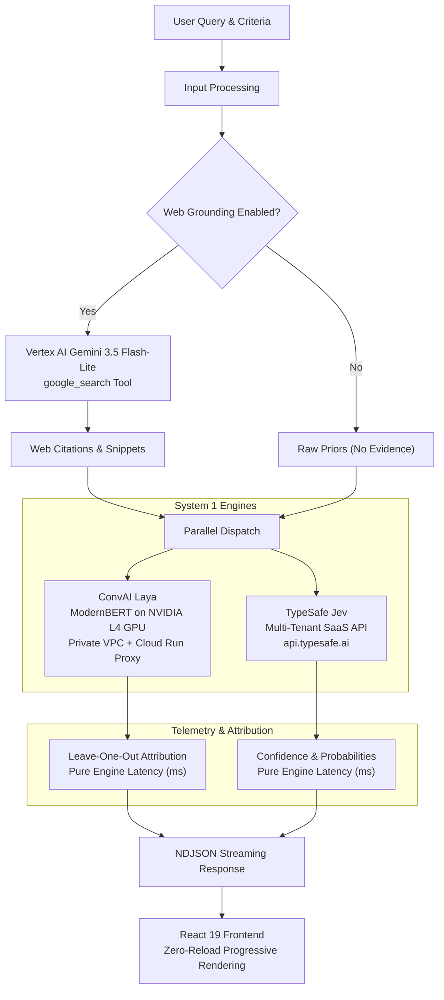
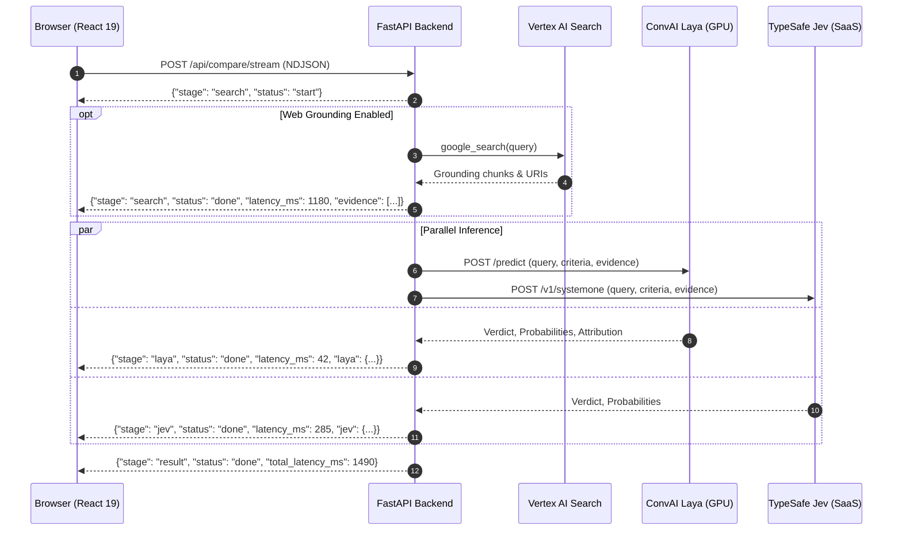
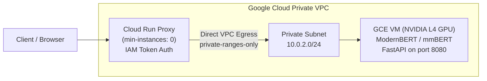

# System 1 Head-to-Head Decision Bench Specification

## 1. System Overview

The System 1 Decision Bench compares fast, calibrated, non-autoregressive decision models head-to-head on deterministic choice and scoring tasks. It evaluates how open-weight private GPU models (**ConvAI Laya**) compare against proprietary SaaS APIs (**TypeSafe Jev**), both with live web search grounding and with raw model priors.

## 2. Sequence and Streaming Protocol

The system provides progressive NDJSON streaming so that each engine renders the moment its inference completes, without waiting for the other engine or triggering full-page UI unmounts.

## 3. Component Specifications

### 3.1 Backend Service (Python / FastAPI / uv)

* **Runtime**: Python 3.12+, managed via `uv`.
* **API Endpoints**:
  * `POST /api/compare/stream`: Progressive NDJSON stream comparing Laya and Jev.
  * `POST /api/decide/stream`: Progressive NDJSON stream for Laya-only decision.
  * `POST /api/compare`: Synchronous comparison response.
  * `POST /api/decide`: Synchronous Laya decision response.
  * `GET /api/health/laya`: Non-throwing reachability probe verifying IAM token and Cloud Run proxy path.
  * `GET /api/status`: System configuration and provider availability.
* **Model Clients**:
  * `System1LayaClient`: Authenticates via Google Cloud IAM ID tokens and communicates with the Cloud Run Direct VPC Egress proxy.
  * `System1JevClient`: Communicates with the TypeSafe Jev SaaS API via bearer token authentication.
  * `System2GeminiClient`: Uses Vertex AI Gemini 3.5 Flash-Lite with the `google_search` tool for citation grounding.

### 3.2 Frontend UI (React 19 / Vite / TypeScript / bun)

* **Runtime**: Bun + Vite + React 19 + TypeScript.
* **Styling**: Tailwind CSS v4 with OKLCH color space for perceptually uniform light and dark themes.
* **Icons & Animation**: Phosphor Icons (`@phosphor-icons/react`) and Framer Motion (`motion/react`).
* **Design Guidelines**:
  * Persistent workspace (`BenchWorkspace`) with stable React keys to prevent UI unmounting during stream transitions.
  * Explicit latency separation: Web Search time vs Pure Engine latency vs Total time.
  * Leave-one-out source attribution ledger with delta point indicators (`+N pt`, `-N pt`).
  * Instant presets for quick scenario exploration.

### 3.3 Infrastructure & Network Topology

* **Cloud Run Proxy**: Sits in the VPC network with Direct VPC Egress, terminating public IAM requests and relaying traffic to the internal GPU VM address (`10.0.2.x:8080`). Configured with `connect=2.5s` timeout to fail fast if the GPU VM is preempted or stopped.
* **GPU Worker**: G2 instance (`g2-standard-4`) with NVIDIA L4 GPU, running self-hosted Laya service via `systemd`.
